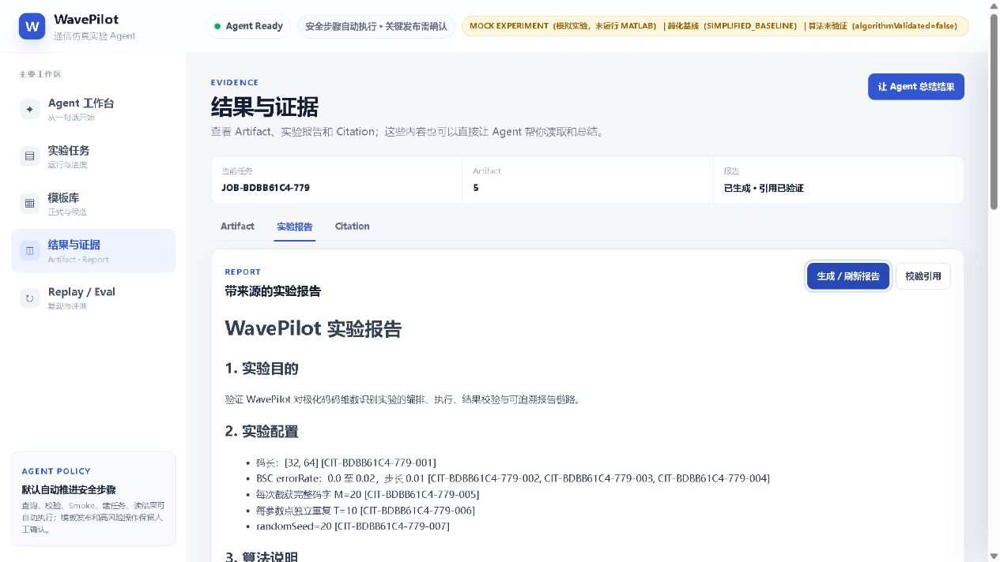
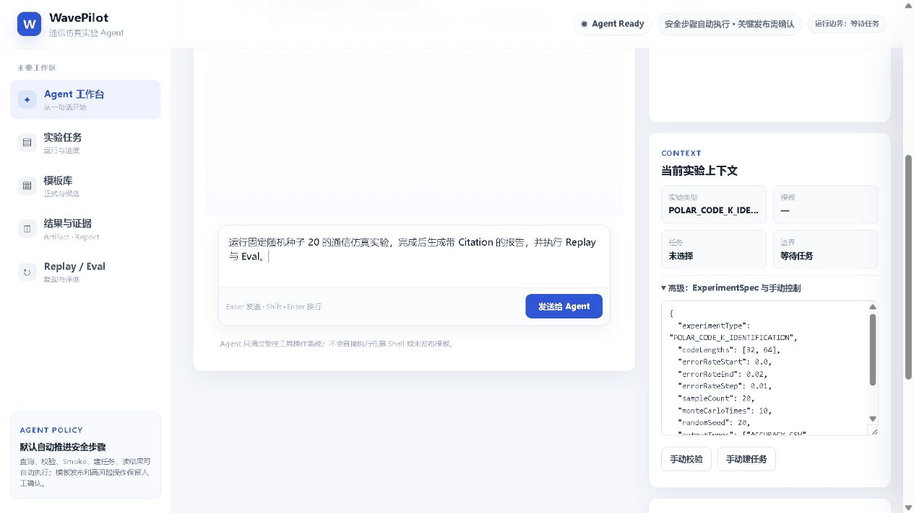

# WavePilot

[](https://github.com/tdO-0/WavePilot/actions/workflows/java17-ci.yml)

[](LICENSE)

面向通信仿真实验的 Agent 平台：把实验目标编排为受控的 `ExperimentSpec`，完成 Java 确定性校验、异步执行、Artifact 完整性校验、带 Citation 的报告、Replay 复现和离线 Eval。

> 该仓库于 2026 年 8 月整理后公开，项目开发此前主要在本地完成。

<p align="center">
  
</p>

界面截图来自仓库当前版本的实际运行：固定随机种子 `20`、离线 Mock Runner、内存知识库。页面会明确显示“未运行 MATLAB”和 `algorithmValidated=false`，不会把软件闭环演示包装成科研性能结论。

## 30 秒演示

<p align="center">
  
</p>

演示依次覆盖：目标输入 → Spec 校验 → 6/6 参数点完成 → 5 个 Artifact 校验 → Citation 报告 → Replay 零差异 → 24/24 离线 Eval。

## 可复现证据

仓库自带固定输入、期望 CSV、期望指标和一键校验脚本：[examples/reproducible-showcase](examples/reproducible-showcase)。本地实际运行结果如下：

| 检查项 | 结果 |
|---|---:|
| Maven 单元/契约/集成测试 | 363/363 通过 |
| 固定实验参数点 | 6/6 完成 |
| 已登记且通过完整性校验的 Artifact | 5/5 |
| Accuracy（min / max / mean） | 0.901584 / 0.957320 / 0.9283471667 |
| Replay | `REPRODUCIBLE` |
| Replay accuracy 最大绝对差 | 0（容差 `1e-9`） |
| 离线 Eval Case | 24/24 通过 |
| 值为 1.0 的 Eval 指标 | 11/11 |

这些指标用于验证编排、产物契约、数值 Grounding、Replay 和 Eval 链路；它们不是通信算法 benchmark，也不代表真实 MATLAB 执行结果。

## 快速开始

需要 JDK 17+ 和 Maven 3.9+。默认使用安全的 Mock Runner；下面的配置完全离线，不需要 API Key、Milvus 或 MATLAB。

```powershell
$env:WAVEPILOT_KNOWLEDGE_REPOSITORY = "memory"
$env:WAVEPILOT_EMBEDDING_OFFLINE = "true"
$env:DASHSCOPE_API_KEY = "not-configured"
mvn -B clean test
mvn spring-boot:run
```

打开 <http://localhost:9900>。另开一个 PowerShell 复现 GitHub 展示案例：

```powershell
.\examples\reproducible-showcase\run.ps1
```

脚本任一断言失败都会返回非零退出状态；成功时输出 Job、Replay、Eval 编号及全部量化结果。固定期望值见 [expected/metrics.json](examples/reproducible-showcase/expected/metrics.json)。

Docker 全栈启动：

```powershell
docker compose up -d --build
```

该方式会启动 WavePilot 与 Milvus；默认仍为 Mock Runner。

## 核心能力

- Agent 编排：自然语言目标、缺参补充、受控工具调用和人工审批边界。
- 实验执行：Java 状态机、异步 Job、SSE 实时进度、取消和固定模板 Runner。
- 证据链：Artifact SHA-256、结构化结果校验、数值到 CSV 行/字段的 Citation。
- 报告：确定性模板报告；可选受控模型只润色已 Grounded 的数据。
- Replay：保留原随机种子并创建独立任务，比较 Fingerprint、CSV 和 summary。
- Eval：24 个固定 Case 覆盖解析、校验、工具安全、提交、引用、Grounding 与 Replay。
- 模板治理：候选生成、安全校验、Smoke、显式批准、版本激活与回滚。
- 知识库：内存离线模式或 Milvus metadata 过滤，可选 DashScope Embedding。

```text
实验目标
  → ExperimentSpec / Java 校验
  → 受控 Runner / 状态机 / SSE
  → Artifact 登记与 SHA-256 校验
  → Citation 报告
  → Replay + Offline Eval
```

## 运行模式与边界

| 模式 | 配置 | 用途 |
|---|---|---|
| 确定性离线演示 | `WAVEPILOT_RUNNER_TYPE=mock` | 无外部依赖地验证完整软件链路 |
| 本机 MATLAB | `WAVEPILOT_RUNNER_TYPE=local-matlab` | 在可信主机上执行仓库内固定 MATLAB 模板 |
| 离线知识库 | `memory` + `WAVEPILOT_EMBEDDING_OFFLINE=true` | 测试与演示 |
| 持久化知识库 | `milvus` + 有效 DashScope Key | 真实向量检索 |

Mock 输出始终带 `mock=true`。`algorithmValidated=false` 表示简化基线尚未经过论文或标准级科学验证；Replay 一致只证明同一输入可复现。

## 技术栈

- Java 17、Spring Boot 3.2、Maven
- Spring AI Alibaba / DashScope（可选）
- Milvus Java SDK（可选，离线模式不需要）
- 原生 HTML/CSS/JavaScript 工作台
- JUnit 5、Spring Boot Test、GitHub Actions

## 进一步阅读

- [自主 Agent 模式](AUTONOMOUS_MODE.md)
- [架构说明](src/docs/ARCHITECTURE.md)
- [Artifact 证据模型](src/docs/ARTIFACT_PROVENANCE.md)
- [Replay 设计](src/docs/REPLAY_DESIGN.md)
- [Eval 设计](src/docs/EVAL_DESIGN.md)
- [前端工作台](src/docs/FRONTEND_GUIDE.md)
- [安全边界](src/docs/SECURITY_BOUNDARIES.md)
- [扩展实验类型](src/docs/EXPERIMENT_TYPE_EXTENSION_GUIDE.md)

## License

[Apache License 2.0](LICENSE)
